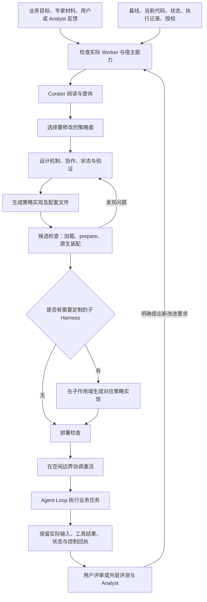
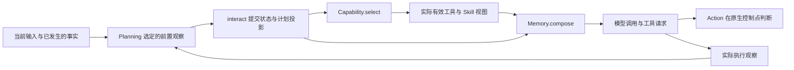
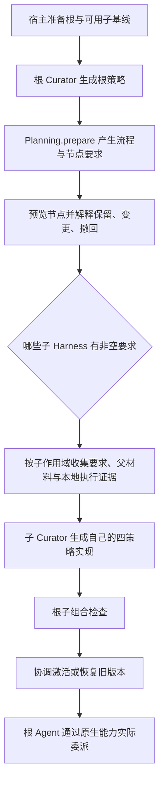

# Curator 完整流程：从专家材料到四策略 Harness

本文对应当前代码实现，包含新版 Planning 的 initialize/interact 协议。阅读顺序是：先理解生成的对象，再看生成与装配，最后看运行、根子协作和反馈。具体方法签名以链接到的公共协议为准。

Curator 的工作是把目标、材料和反馈转成 Harness 的行为实现。**四策略是行为生成的一等入口：Memory、Planning、Capability、Action。** 原生 Agent Loop、模型连接、权限和可用部署能力由宿主提供；Curator 在这些边界内生成具体实现。

## 1. 一张图看完整过程



图中的两种“计划”不同：Curator 的 Plan 是改造 Harness 的方案；Planning 策略维护的是 Agent 执行业务时的计划。客户需求、专家长期职责、Curator 构建要求分别传递，避免把实现机制的要求写进客户交付清单。

## 2. 谁决定什么

| 参与者 | 主要决定 | 实际边界 |
|---|---|---|
| Raven 原生运行时 | Turn/Iteration、工具执行、权限、原生上下文与调度、ACP 生命周期 | 提供实际执行机制；策略声明不能跳过权限或创造不存在的服务 |
| Raven Adapter | 声明可生成入口、提供协议与来源、绑定代码、检查候选、装配、保存状态与证据 | 将生成代码接到原生机制；不代替 Curator 编写业务规划或评审标准 |
| Curator | 修改哪些策略、采用哪些材料、交互语义、流程、资源和干预规则 | 输出具体实现；遵守当前 Declaration 和宿主提供的能力 |
| 执行业务的 Agent | 在本次模型输入和可用能力下理解需求、调用工具、交付结果 | 受生成策略及原生运行时共同约束 |
| 用户、评测方与 Analyst | 判断结果、指出缺口、提出后续要求 | 评测结果与改进要求通过明确入口反馈，不自动改写运行代码 |

Curator 可以选择沿用已有行为，也可以只改一个策略。四个入口不意味着每次必须重写四个模块。最终验收看 Harness 配合模型能否完成用户任务；策略数量、调用次数和是否使用子层仅作为过程事实，不是覆盖率指标。

### 设计原则与实现规范

本实现遵循仓库 [AGENTS.md](../../AGENTS.md) 和 [experimental 规范](../AGENTS.md)，具体落实为：

- **语义归属明确**：Curator 生成四策略代码，业务规则、Skill 采用与生成、计划和评审语义由对应策略拥有；Adapter 负责原生机制连接、资源生命周期、类型与权限约束。
- **最小完整协议**：按当前需求提供初始化、交互、投影、注册与控制入口，不用固定的私有方法流水线规定业务实现；选用的方法必须有真实消费者和可达触发点。
- **协作显式、状态有界**：跨策略调用经过具名 peer 接口，保留来源与会话身份；查询只读，状态提交后发布；单步语义判别由执行业务的模型完成，沿用明确预算，不在策略内另开 Agent Loop。
- **复用原生能力**：沿用 Raven 的上下文、工具、Skill、Playbook、ACP 和恢复机制。根子 Harness 按实际部署与任务分工，不为测试简化成固定单层，也不要求每次定制子层。
- **失败可解释**：区分契约错误、资源不可用、上下文压力和模型业务质量；修复共享机制，不用人工改写某个模型产物掩盖问题。
- **证据与范围一致**：以实际任务交付验收，确定性回归用于验证机制。测试记录模型、窗口、预算、产物与未通过项；文档、代码、调用方同步更新，不保留无需求依据的旧 target 别名。

## 3. 四策略作为一等生成入口，具体意味着什么

### 3.1 从选面到运行，始终围绕策略的业务责任

“一等生成入口”有以下具体含义：

| 环节 | 四策略在其中的地位 |
|---|---|
| 决定改哪里 | Curator 的 Selection 选择 memory.strategy、planning.strategy、capability.strategy、action.strategy 中必要的入口 |
| 说明为何这样改 | Plan 将业务要求、协作方式、状态归属及验证方式关联到所选策略 |
| 交付实现 | Artifact 的 values 指向具体策略工厂，files 携带实现类及其依赖文件 |
| 决定资源如何生效 | 生成类的 prepare/register 等代码明确采用内容、配置或资源 |
| 执行业务行为 | Adapter 在真实事件和模型调用边界调用这些生成实例 |
| 解释结果与继续改进 | 记录中能关联到策略操作、会话、版本和实际消费者；反馈据此改进对应实现 |

因此，一个专家的“怎么记、怎么规划、能用什么、何时允许继续”都有明确的代码所有者。配置、提示词、Skill 或流程图分别服务于这些所有者，不再作为独立平行 Target 自行承载另一套行为实现。

四个入口是一组责任边界，每次生成可以只选择需要修改的部分。未修改的部分继续使用已有绑定或原生行为。

### 3.2 三层代码各自是什么

| 层次 | 例子 | 谁维护、何时改变 |
|---|---|---|
| 公共策略协议 | MemoryStrategy、PlanningStrategy 等 | 仓库维护者定义方法、数据契约及语义边界；一次普通 Curator 生成遵守它们 |
| 专家具体实现 | 继承 PlanningStrategy 的具体类、PlanCommand/PlanReply、状态更新与投影逻辑 | Curator 生成或修订，成为该 Harness 的 authored package |
| Raven 接入实现 | BoundPlanning、BoundMemory、能力目录、原生 Hook/Tool 绑定 | Adapter 维护，将生成实例接到 Raven 的生命周期与消费者 |

例如，Curator 可以生成一个阶段式规划器，也可以生成一个依赖图规划器。两者都实现 initialize/interact，但状态结构、命令、推进规则和指导内容可以完全不同。Adapter 根据共同契约接入，不根据“旅行”“招聘”等业务名称内置对应算法。

Curator 的公共策略协议与 Raven 原生同名模块有各自的接口。Adapter 通过实际的 Hook、Tool、上下文装配和模型调用边界接入生成实例；这种映射把策略语义送到真实消费者，同时保留原生 Loop 的生命周期。

生成包可以复用现有组件、公共 Prompt 工具或内部辅助模块。类的公共协议稳定，内部代码组织由实现选择；不要求每次重新实现原生存储、目录复制或 Agent Loop。

工厂按当前角色提供的依赖声明参数。例如当前 Planning 工厂接收 state，可选 host、peers、infer、plan；plan 返回本会话已提交视图的副本，初始化前为 None。Memory 等消费者也可取得 plan，Memory 还可选用 shared。依赖仍以各角色绑定实际提供的范围为准。

工厂是同步、惰性的构造入口。候选准备使用明确的 `def prepare(self, request: PreparationRequest) -> None` 签名；运行期方法按各自协议实现。具体方法注解参与 schema 生成与宿主校验，是执行契约的一部分。

### 3.3 最终输出长什么样

[Artifact](../curator/harness/artifact.py) 的载体包含：

| 字段 | 内容 | 与一等入口的关系 |
|---|---|---|
| values | 四策略的工厂引用、工具声明、事件/观察绑定等 | 指定哪份实现接管哪个策略责任，以及它需要哪些接入路径 |
| files | 完整 Python 源码、提示词、模板、生成的 Skill 文本等 | 为选中的策略实现提供代码和资产 |
| remove | 撤回已有策略绑定 | 明确停止该 authored 实现的接管 |
| remove_files | 撤回已有辅助文件 | 明确清理不再使用的代码或文本资产 |

下面只展示 values 的结构；工厂引用的模块还必须由完整 files 或已有 authored 文件提供：

```json
{
  "memory.strategy": {
    "factory": "memory_impl:create"
  },
  "planning.strategy": {
    "factory": "planning_impl:create",
    "tool": {"name": "expert_plan", "description": "Query or update the current task plan."},
    "context": true,
    "observe": ["before_model", "after_iteration"]
  },
  "capability.strategy": {
    "factory": "capability_impl:create"
  },
  "action.strategy": {
    "factory": "action_impl:create",
    "events": ["proposal"]
  }
}
```

这个对象放在 Artifact.values 中。Artifact.files 可能对应如下组织，每个条目的值是该文件的完整文本：

```text
memory_impl.py
planning_impl.py
capability_impl.py
action_impl.py
shared_types.py
prompts/review.md
assets/expert_profile.md
skills/domain-method/SKILL.md
skills/domain-method/references/checklist.md
```

这些名字只是结构示意。实现可以拆成多个模块，也可以让多个类共享纯类型和辅助函数；共享文件不意味着共享可变业务状态。

这里同时包含了程序和声明，但分工明确：Python 实现业务规则，绑定声明连接宿主调用位置，资产提供被代码消费的内容。把一个 prompt 文件放进 files 不会自动注入模型；把一个 Skill 文件放进去也不会自动安装。

更新时，未提及的已有绑定与文件保留；撤回应显式表达。某个 owner 的 prepare 则描述它本版完整希望生效的资源/内容集合。提交更新的含义与 prepare 的资源归属语义，需要分别理解。

### 3.4 Memory：Curator 生成上下文组织与信息操作

Memory 面的生成内容包括上下文组织方法、信息命令类型、答复类型、状态表示，以及具体的消息投影逻辑。

| 位置 | Curator 在代码中决定什么 | 宿主提供什么 |
|---|---|---|
| prepare | 采用哪些画像内容、选择哪些原生上下文/存储依赖 | 受约束的 MemoryHost 服务及候选安装机制 |
| initialize | 如何利用实际来源、历史和恢复状态建立本会话的组织方式 | InitialContext，包括真实来源、消息、历史、身份和恢复标识 |
| interact | 记录、查询、纠正、归并等具体操作及其含义 | 受校验的命令、真实来源、作用域和 query/command 约束 |
| compose | 本次应呈现哪些信息、如何组织来源、计划与能力信息 | 当前消息、来源、有效能力、计划和上下文预算 |
| compact（选用） | 压力条件下如何减少投影且保持必要信息 | 可达的压力触发点、原生恢复边界和预算 |

有效投影超过输入额度时，Adapter 在模型调用边界记录本地上下文压力，交给 Raven Loop 原有的 overflow 收缩与有限重试流程；未选自定义 compact 也可走这条恢复路径。超限输入不会先发给 provider，来源保护或消息配对错误仍按契约错误报告。原生收缩无法腾出空间、或生成代码反复加入过大内容时，依然可能失败；这不是无限重试或自动保证任意投影都能放入窗口。

例如，同一份客户需求可以组织成事实表、带来源的事件记录或分主题记忆。Curator 决定具体方法；宿主不预设一套“客户字段名”。

initialize 的结果会进入后续 compose；它应体现初始化的组织决定。compose 使用动态输入，不能仅重复一份初始化时冻结的 system prompt，也不能偷偷将投影写回永久状态。

画像文本可以通过生成代码在 prepare 中交给原生 profile 服务，复杂上下文组织也可以委托适合的原生组件。Curator 仍负责选择与消费方式，Adapter 负责实际接入和保护必须保留的内容。

### 3.5 Planning：Curator 生成规划语义、状态演进与计划表达

Planning 面的主要生成内容包括：计划视图 ViewT、业务命令 CommandT、答复 ReplyT、状态表示、推进规则，以及可被其他策略使用的投影。

| 位置 | Curator 在代码中决定什么 | 产生的结果 |
|---|---|---|
| prepare | 是否采用可复用流程、如何组织已有子节点、哪些行为需要子层定制 | 经 PlanningHost 产生的 Playbook 与节点 requirements |
| initialize | 新任务如何起步、已有进度如何恢复 | 当前 PlanningProjection |
| interact | 查询、提出修改、报告阻塞、申请完成、接收实际证据等命令的处理 | 业务 reply 与操作后的 projection |
| projection.view | 其他策略应如何理解当前计划 | 有明确具体类型的只读视图 |
| projection.guidance | 当前计划要怎样指导模型 | 进入正常上下文组装的规划文本，或撤回指导的 None |

公共协议不把“创建、完成、重排”等动作固定为方法，也不规定每个专家都采用同一组状态字段。清单、阶段状态机、依赖图和部分计划都可以由生成实现表达。

一个“完成申请被拒绝”的业务结果，可以同时记录缺少的证据和阻塞。业务判断由生成代码决定；宿主负责 query 不改变状态/投影、成功保存后发布、错误恢复等执行约束。

投影可以使用具有相同 ViewT、且不增加公共包裹字段的具名子类；宿主校验声明类型后，将 view/guidance 归一为公共投影再发布。领域扩展字段放在 ViewT 中。

宿主的 read_plan 读取最近提交的 view。它是给其他消费者的读取服务，Planning 不再需要独立公共 view/revise 方法。

流程资产和运行期计划分属两个生命周期：prepare 中的流程描述一类任务如何组织；interact 管理当前会话实际到了哪里。创建了流程、选择了子节点、子任务实际成功，都需要各自证据。

### 3.6 Capability：Curator 生成能力采用与选择策略

Capability 面的代码决定资源如何成为本 Harness 的能力，以及每次模型调用得到哪些能力表达。

| 位置 | Curator 在代码中决定什么 | 宿主承担的机制 |
|---|---|---|
| prepare | 采用现成包，或从材料生成 Skill、工具与必要依赖 | 受约束的候选资源和原生配置服务 |
| register | 接受、拒绝或复用哪份工具/Skill 贡献 | 实际目录登记、身份/冲突校验、注册回执 |
| select | 根据任务、当前计划和可用目录选择工具、Skill 与交付方式 | 原生可见性/权限约束及最终有效能力视图 |

Skill 有两条常见产生路径：

- **采用用户提供的包**：Curator 检查完整目录，在 Capability 代码中构造带来源、包根和摘要的贡献，并调用 register。Adapter 核验摘要、保存完整目录并接入原生发现。
- **从普通资料生成包**：Curator 编写 SKILL.md、引用材料、模板或脚本，将文本作为配套文件交付；Capability 代码明确组织这些文件并注册对应贡献。

两条路径的内容、采用条件和管理决定都在 Curator 生成的实现中。文件复制、摘要核验、原生目录接入由宿主通用机制完成；这使生成代码可以复用可靠的资源管理能力。现成包的二进制附件可随包采用；Artifact.files 本身是文本文件载体。

Skill 名称与正文、原生解析出的元数据、运行所需工具是不同对象。保存完整文件包不能自动补齐原产品的账号、MCP 或脚本运行环境。

跨策略工具也经过 register：Planning 声明自己的交互入口，Adapter 提交 owner=planning 的工具贡献，Capability 接纳后安装。调用时解析到当前会话的 Planning owner；Capability 不复制一套规划状态。

### 3.7 Action：Curator 生成判断条件与控制决策

Action 面的代码决定何时检查行为、依据什么事实判断，以及如何把结果映射成宿主允许的控制。

| 入口 | Curator 在代码中决定什么 | 调用来源 |
|---|---|---|
| prepare | 需要哪些原生生成与执行策略设置 | 候选构建阶段 |
| handle_event | 如何处理输入、进展、行动提议、实际结果、失败和控制回执 | Harness 在选定的原生事件点主动调用 |
| handle_request | Agent 或其他策略主动请求评估时，命令和答复如何解释 | 经工具或 peer 到达同一 Action owner |

具体实现可以整体实现 handle_event，也可以复用协议已有的事件分发，选择覆盖相应 _handle_* 方法。方法选择与事件绑定要一致。

Curator 可以生成规则判断，也可以生成调用 infer 的语义判断机制。后者包括评审提示词、证据选择、结构化结果类型、触发条件及结果到控制的映射。运行时执行判断的是 Worker 模型，Curator 不在每次业务判断中重新参与代码生成。

例如，某条输出需要修改：Action 代码产生判断和可消费的反馈，Adapter 检查当前阶段是否允许 revise，再由原生 Loop 应用并产生回执。诊断 reason 不会自动变成纠正提示，声明了一个控制也不等于它已经 applied。

Action 可以读取计划、查询信息或请求其实际 owner 更新状态，但不直接维护第二份 Planning 或 Memory。涉及工具执行的必要条件，应放到真正能拦截执行的检查点；模型主动请求一次评审，不能代替该检查点。

### 3.8 同一条业务要求可以跨策略落地

假设专家要求“保留客户约束；关键信息核验后再交付；需求变化后修改已有方案”。对应的代码协作可以是：

| 责任 | 对应生成实现 | 实际生效证据 |
|---|---|---|
| 记录当前约束与来源 | Memory 的具体命令、状态及 compose | 信息操作结果、后续模型输入 |
| 表达待核验项与后续安排 | Planning 的具体命令、状态转换和投影 | 已提交计划、阻塞与推进记录 |
| 提供核验工具和领域方法 | Capability 的包采用、注册与选择 | 安装目录、有效工具/Skill 视图和实际调用 |
| 处理缺证据仍准备交付的行为 | Action 的提议检查及控制映射 | 判断结果、控制回执和后续行为 |

这只是责任映射示例，不要求所有任务都新增四份实现。已有原生行为可能足以承担某项责任，Curator 应说明复用关系。相同要求可以被多个策略引用，但修改事实、修改计划和控制执行各有一个明确 owner。

### 3.9 一等生成入口与宿主服务的关系

可以用一条连续链条理解：

```text
业务要求
  → Curator 选择策略责任
  → 生成具体实现、类型和配套资产
  → 绑定找到工厂并构造实例
  → 实例通过 prepare/register 选择资源与原生依赖
  → Adapter 在正确时机调用实例
  → 原生消费者实际应用结果
  → 执行证据回到该策略的后续改进
```

这次收敛消除了通过另一个平行 Target 绕开策略所有者来定义同一行为的路径。它保留了 JSON 绑定、数据模型、资源贡献和宿主服务，因为这些是生成代码连接真实 Harness 所需的契约。

查看一份生成结果时，应能从所选策略入口找到：具体类在哪里、资产被哪段代码消费、状态归谁、何时被调用、结果由谁执行、怎样核验效果。这是判断四策略是否真正成为生成中心的实际标准。

## 4. Curator 如何获得足够的信息

入口 [workflow.improve](../curator/workflow.py) 先检查实际 Worker，构造当前生成上下文。

输入包括业务 Task、反馈、宿主事实、当前 authored 代码、前一份改造方案、实际执行记录，以及可读取的源码与资源。Declaration 给出本次可以选择的 Target、绑定 schema、公共契约、状态边界和原生知识入口。

信息按用途组织：

- 职责概览帮助 Curator 判断要改哪个策略。
- 所选策略的协议、docstring 和生成指南说明应生成什么。
- Adapter 绑定说明实际回调、输入来源、时序、检查点和消费者。
- Raven 原生实现说明可以复用的机制与限制。
- 当前代码与执行证据帮助区分“已经声明”和“实际生效”。

Curator 可以继续查询注册的源码、事实和执行观察。结构化查询是只读的；宿主也可以提供隔离探索目录中的原生工具。exec 只有在宿主具备实际 OS sandbox 时才会提供，不假定每个环境都有相同探索能力。

读取内容带有来源与摘要。候选基于的源码、状态或契约改变后，旧候选不能直接覆盖新状态。测试私有材料通过 withheld 边界隔离，不作为专家答案提前交给 Curator。

对应入口：[信息收集与生成](../curator/generation/run.py)、[源码注册](../curator/raven_adapter/inspection/sources.py)、[探索环境](../curator/raven_adapter/exploration.py)。

## 5. 一次生成如何推进

| 环节 | Curator 的产物或动作 | 宿主检查什么 |
|---|---|---|
| 归因（独立步骤） | 在自己的一次对话里阅读、查询，对每条输入（要求 id、交出的资料、路由的节点要求，或任务本身）提交 Diagnosis：负责的机制、状态（闭集八种）、证据、此前处理 | 是否每条必需输入都有诊断；归因有自己的预算、检查点与记录 |
| 选面 | 提交 Selection：目标与每个目标引用的诊断 | 选择的 Target 是否在本次允许范围内、是否都引用了已提交的诊断 |
| 机制设计 | 提交 Plan：设计、每项变更的理由、对点名机制是修改、替换还是新增、状态、预期与验证；组合根还说明节点处置理由 | 与所选入口及组合节点是否一致 |
| 代码实现 | 分文件暂存或提交 Artifact | 文件路径、工厂引用、字段和权限范围是否合法 |
| 候选预检 | check_candidate | 实际执行的构造检查和可选 probe；使用独立检查预算 |
| 提交与验证 | 形成 Candidate，调用 Worker 检查 | 加载、类型、准备效果、装配及指定检查是否成功 |
| 修复或重设计 | 根据验证错误修复；必要时重新选择策略或修改 Plan | 每次使用当前方案重新检查，旧方案结果不能冒充新验证 |

归因是生成之前的独立组件（[归因是独立的组件](cultivation-loop-design.md#513-归因是独立的组件)）：理解在这里落成结构化的诊断，生成只接收诊断，选面与设计引用它。默认的 `ModelAttributor` 在 Curator 的 provider 与模型上开自己的一次对话；换模型、去掉 target 目录、换一版提示词目录，或交入人审过的诊断（`SuppliedAttributor`），都是换一个归因器，其身份写进每次归因的记录 `<worker>/attribution/<uuid>.json`。归因暂停时下一次改造从它续跑；生成按实际状态在 select、design、implement、repair 等环节推进，暂停后续跑不重做归因。

对应入口：[归因组件](../curator/attribution/model.py)、[只归因的入口](../curator/workflow.py) 的 `attribute`。

预算限制模型调用、查询、预检和修复次数，也限制单次调用的时间与输出。调用预算耗尽或外部调用中断时，保存已有调查和进度；恢复会检查输入身份，并使用累计预算。改了输入或基线不能悄悄沿用原进度。

这里的 Curator 模型调用用于写实现代码。业务执行中的模型调用、以及策略的单步语义判断，是另外两条运行路径。

## 6. 从代码到原生 Harness：factory、prepare、initialize


三种阶段各有目的：

- factory 绑定显式依赖并构造对象，不直接启动业务任务。
- prepare 决定该候选的配置、内容和资源效果，可能在检查、安装和重启时重复执行。
- initialize 在真实会话范围建立或恢复状态。它与候选准备使用的实例不是一个可依赖的私有状态传递通道。

角色宿主提供受约束的原生能力，例如 MemoryHost.profile、PlanningHost.playbook、CapabilityHost.tools/skills/mcp，以及 ActionHost.generation/execution。宿主校验这些请求并汇总为 PreparedHarness，再执行原生装配。**PreparedHarness 是宿主执行代码后形成的结果，不是第五个 Curator 输出入口。**

Prompt 的索引也不会自动注入模型。具体策略代码需要选择何时、用哪些参数渲染并消费它。

详见 [候选准备契约](../curator/raven_adapter/reference/preparation.md) 和 [装配实现](../curator/raven_adapter/bind.py)。

## 7. Skill 如何保存、发布并被使用

以一个包含 SKILL.md、references 和 templates 的包为例：


现成包可以通过路径和内容摘要引用，保留嵌套文件与功能资产；普通资料可以由 Curator 编写成新的 Skill 及配套文件。两种方式都由 Capability 实现决定，并经过 register。

这里至少有四个不同事实：注册被接受、资源已安装、本次模型可见、Agent 实际使用。注册回执不证明后面三项已经发生；正文进入模型也不证明规定的步骤被执行。必须分别看安装目录、有效能力视图、provider 输入和实际工具结果。

Memory 与 Planning 可以借 Capability 发布自己的交互工具。工具的业务语义和状态仍属于原策略，Capability 负责接纳和选择，不另建一个副本 owner。

## 8. 运行期四策略怎样协作

宿主先完成需要的会话初始化。每次模型调用前，核心数据流是：



### Planning 的答复与投影

initialize 返回 PlanningProjection；interact 返回业务 reply 和 projection。view 是其他策略可读的计划，guidance 是当前计划对模型的指导。

成功命令先保存状态，再发布投影。query 不改变持久状态或投影；查询产生的建议可以放在 reply 中。业务拒绝可以记录阻塞。错误保留上一次有效投影，并恢复自身状态。重建会话 owner 时重新 initialize，恢复已有进度和投影。

前置观察早于 Capability 的本次选择，因此新客户约束可以影响同一轮的工具集合。执行后观察依据真实结果更新计划；尚未处理的当前提议仍需由 Action 的当前事件提供，不能假定已经写进计划。

### 交互与内部协作

面向 Agent 的工具通过 Capability 发布；其他策略使用显式 peer 接口，例如 read_plan、interact_planning、interact_memory、request_action。

Memory/Planning 的查询约束沿调用链传播，嵌套请求不能将只读升级为写入。每个 owner 保存自己的状态；跨 owner 成功操作分别提交。循环等待和同一所有权链内的并行分叉被拒绝，避免死锁和隐式共享状态。

### Action 的单步语义判断

Curator 可以在 Action 代码中定义触发点、评估提示词、输入证据、结果类型及消费方式。执行期调用的是 Worker 模型的单步 infer：不带工具、不递归启动 Agent Loop，不进行内部模型修复循环。

一次外层策略操作与其顺序 peer 调用共享一次尝试，并受 turn、时间与输出预算约束。判断结果只是数据；Action 必须将它映射到该事件实际允许的控制，最后由宿主记录控制是否 applied。生成了“需要修改”的判定，与 Loop 实际重新执行，是两份不同证据。

协议入口：[四策略](../curator/harness/strategies/)、[Planning](../curator/harness/planning.py)、[交互](../curator/harness/interaction.py)、[单步推理](../curator/harness/reference/inference.md)。

## 9. Harness-of-harnesses 如何生成和管理

当前组合入口依据 Worker 是否拥有受管理子 Harness 决定是否进入组合生成。宿主提供子基线和授权；Curator 决定业务分工和定制；运行期 Agent 决定实际调用。



Plan.node_reasons 的键是实际流程节点的完整标识，例如 itinerary/verify；它需要覆盖当前、新增及撤回的 Playbook 节点。子 Harness 名称用于设计中的分工说明；如果当前与候选都没有流程节点，这个映射为空，即使已有可用子 Harness。

根 Curator 不把子策略的 Python 实现塞进任务提示词。子作用域拿到行为要求、实际基线和相关材料，自行生成对应实现。

一个子 Harness 被多个流程节点使用时，要求按其实际 owner 汇集。没有定制要求的子节点仍可能被调用；没有实际调用，也不代表该子基线没有准备成功。以下四项需要分别记录：

1. 可用的子基线。
2. 根方案要求定制的子 Harness。
3. 实际生成并激活的子策略。
4. 业务执行中真正被调用的子 Harness。

当前明确支持宿主管理的根和子池；不因此自动提供任意新角色接纳、无限深递归部署或跨会话共享计划事务。

实现入口：[组合生成](../curator/composition/run.py)、[部署与激活](../curator/raven_adapter/deployment.py)。

## 10. 验证、激活与失败恢复

Candidate 带有基线和契约身份。检查使用状态与资源的副本，加载生成代码并验证准备和装配；可选 probe 再执行指定验证。此时还没有替换活动 Harness。

激活要求根空闲且子调用完成。宿主再次确认当前身份、合并本次 Artifact、检查根子资源归属并保存内容与检查点，然后启动新部署并核对实际子版本。失败时恢复旧制品、内容和状态；这类恢复不撤销之前已发生的外部业务行为。

资源内容由安装账本跟踪归属、撤回和外部编辑。实际 MCP/服务连接问题、构造错误、类型错误都应保留为失败证据，不以删除能力或伪造结果换取通过。

| 检查结果 | 能说明什么 |
|---|---|
| Artifact/schema 合法 | 产物符合提交约束 |
| 候选检查通过 | 本次实际执行的构造与 probe 检查通过 |
| 激活成功 | 指定候选进入活动部署 |
| 工具或 Skill 出现在 provider 输入 | 本次模型实际获得该能力表达 |
| 实际调用与结果记录 | 对应动作确实被请求和执行 |
| 控制 applied 回执 | 对应干预被宿主应用 |
| 业务评审通过 | 该任务在给定评价范围内满足要求 |

## 11. 运行结果怎样回到 Curator

普通客户消息走 Worker.run，不会因每条消息自动重写 Harness。显式调用 improve 才进入改造。

首次构建可以由用户材料与目标触发；后续改造可以由用户反馈，或外层 iteration 的评测 Signal 和 Analyst 要求触发。执行记录携带实际 artifact/turn 身份，避免将旧版本结果归到新版本。

Curator 得到允许读取的反馈、机制行为、原始观察和历史要求，再检查当前实现，选择修复代码、调整策略组合或保留既有行为。propose 只保留检查后的候选；组合流程据此先收齐根子候选，再协调激活。

运行期的计划变化、信息记录与一次 Action 干预，通常只改变当前执行状态。需要改变实现算法、持久 Skill 或部署资源时，才进入新一轮 Curator 构建。

外层入口：[iteration.run](../iteration/run.py)、[反馈筛选](../iteration/hearing.py)、[Curator workflow](../curator/workflow.py)。

## 12. 实际使用与阅读入口

真实专家案例通过 simulation.experts 进入正常 hire_task 部署：完整暂存原专家包，准备实际根子能力，调用 improve，再提交客户请求。暂存不是安装；测试脚本不预写策略答案，也不要求必须调用所有子 Harness。

原始专家材料可能含有宿主没有的账号、命令或工具，也可能有原生元数据解释限制。这些要在结果中说明。保留包文件不等同于完整采用了它的全部语义，业务完成也不能仅靠进程退出码判断。

| 想了解的问题 | 阅读入口 |
|---|---|
| 四策略为什么是唯一生成入口 | [设计总览](design.md)、[Target 目录](../curator/raven_adapter/targets/__init__.py) |
| 方法、数据类型与所有权 | [公共策略](../curator/harness/strategies/)、[公共参考](../curator/harness/reference/) |
| Raven 如何实际接入 | [Adapter 参考](../curator/raven_adapter/reference/index.md)、[bind](../curator/raven_adapter/bind.py) |
| 当前 Planning 的实现与验收 | [Planning 实施方案](planning-strategy-plan.md) |
| 生成预算、检查与修复 | [generation.run](../curator/generation/run.py) |
| 根子生成与协调安装 | [composition.run](../curator/composition/run.py)、[deployment](../curator/raven_adapter/deployment.py) |
| 真实产品案例入口与结果 | [专家包入口](../simulation/experts.py)、[本轮案例记录](expert-package-validation.md) |

本说明描述当前通路和边界。单元/原生回放验证、真实模型生成、真实客户任务完成，分别记录证据；其中一项通过不替代其他项。
