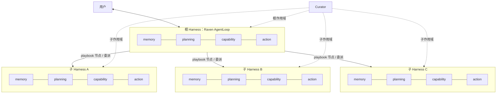
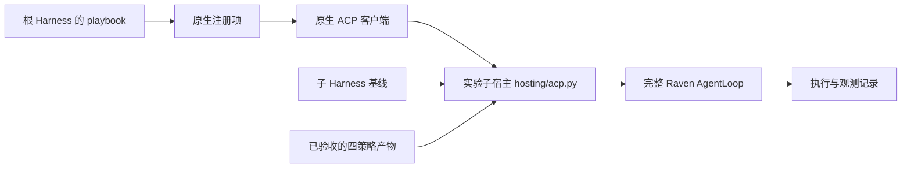
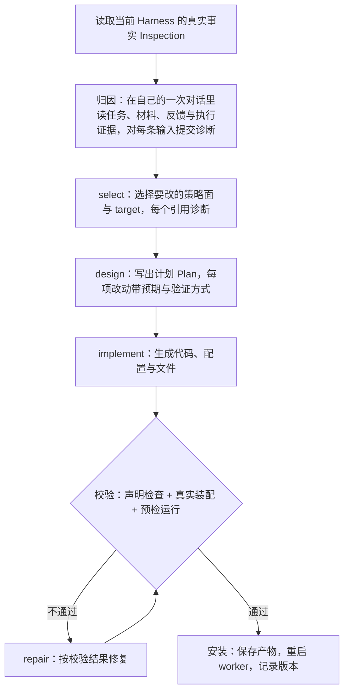
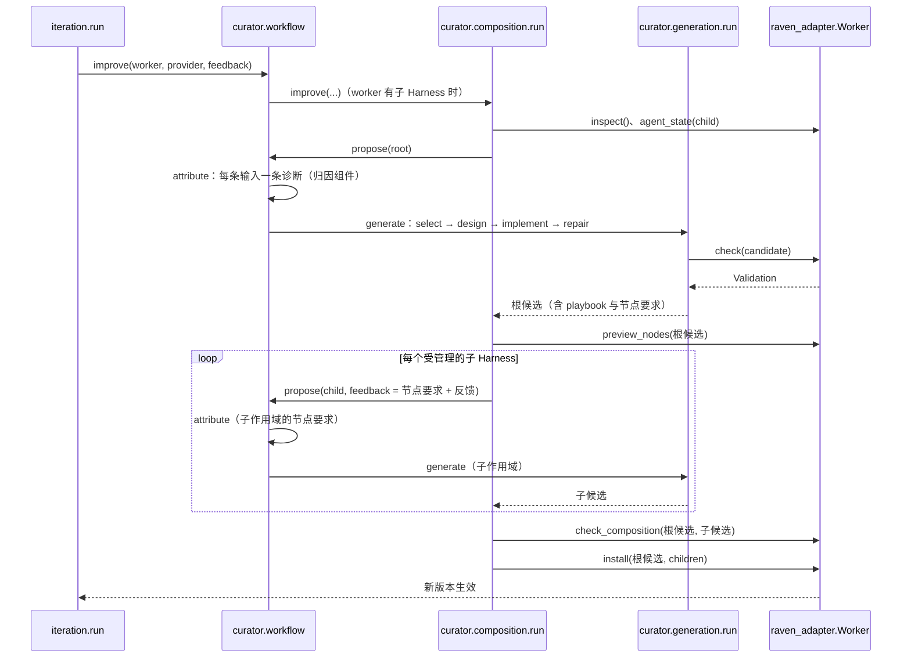
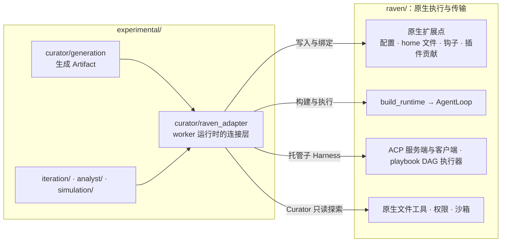
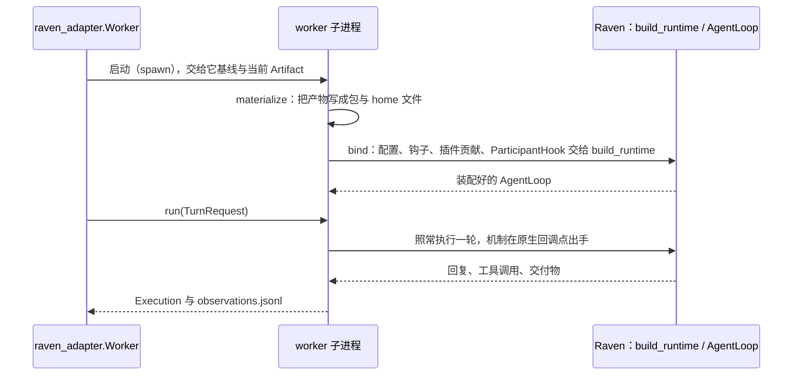

# Curator：生成与管理 Harness-of-harnesses

Curator 读取一个数字员工当前的 Harness，依据任务、材料和反馈生成四策略的实现及配套资产。策略代码决定上下文、资源、流程和控制行为，adapter 将其接入真实 Raven 运行时。组合部署含根 Harness 与宿主提供的子 Harness；Curator 用同一套局部生成协议改造各层，组合宿主校验后统一激活。

本文说明结构与调用逻辑。反馈怎样驱动多轮改进见 [rsi-iteration.md](rsi-iteration.md)。

## 1. 结构：两层 Harness

组合部署最多两层。根 Harness 直接面对用户；它可以通过 Playbook 或委派调用子 Harness，受管子 Harness 不再向下委派。每个 Harness 都是完整的 Raven agent，使用相同的四策略协议。可用子能力由宿主准备，业务分工由 Curator 设计，实际调用由运行时根 Agent 在策略与权限约束下决定；根层独立完成任务也是有效结果。

`Worker(children=...)` 提供可管理的子基线。`workflow.improve` 在 children 非空时进入组合生成，否则只改造本地 Harness。这是入口条件，不是模型自动判断任务应为单层还是两层。simulation 的员工入口会提供受支持的子基线；真实案例应复用这一入口，不能预先删去子能力后把单层结果归因于 Curator。没有受管 children 也不自动说明原生委派工具被禁用，两者需分别检查。



- **根作用域**决定改哪一层、playbook 怎样组织，并通过 playbook 节点的要求文件 `playbooks/<name>/nodes/<node>/requirements.json` 向子层提出行为要求。
- **子作用域**只看自己的真实 Harness、父层要求和相关材料，自己选择并实现满足要求的机制。
- playbook 是根 Harness home 里的文件，写明节点、每个节点交给哪个子 Harness、依赖顺序和节点提示词。Raven 的 DAG 执行器只照文件调度，所以改 playbook 就是改子 Harness 之间的协作结构。

受 Curator 管理的子 Harness 由实验宿主托管：读取基线与已验收的产物，装配四策略，创建完整的 Raven AgentLoop，再挂到原生 ACP 管线上。父层仍经原生注册表和 playbook 调用它。



## 2. 四个策略面

Curator 可选择的语义生成 target 只有四个（`raven_adapter/targets/`）。每个 target 指向策略工厂与其 binding；原生文件、配置、组件和流程都是策略拥有的依赖或效果，不再是平行生成入口。一次修订只改需要的面。

| 策略面 | 管什么 | 唯一 target | 主要表达 |
|---|---|---|---|
| memory | 初始上下文、信息交互与每次调用的投影 | `memory.strategy` | prepare 的原生 profile/存储准备；initialize/interact/compose 与按需 compact |
| planning | 当前任务计划与可复用流程 | `planning.strategy` | initialize/interact 与已提交计划投影；prepare 中的 Playbook 与子节点 requirements |
| capability | 工具与 Skill 的接纳、供给及原生能力准备 | `capability.strategy` | prepare/register/select；完整包、生成 Skill、工具、获准 MCP/插件 |
| action | 宿主监控与 Agent 主动请求的行为判断 | `action.strategy` | handle_event/handle_request；受阶段约束的控制；prepare 的采样/执行政策 |

生成类显式继承对应公共策略。公共操作表达跨宿主语义，角色 Host 提供有类型的 Raven 准备服务。类可以复用受保护方法与原生实现，不要求重写 Loop。文件本身不激活能力；例如 Skill 经 Capability.register 接纳，Playbook 经 PlanningHost.playbook 准备。Action 返回 continue/reject/revise/finish 等受支持决策，原生消费者另行报告是否真正生效。

选择实现时先区分：模型指导、需要恢复的业务状态、必须执行的检查以及原生构造依赖。Skill 可以提供作业指导，Planning 维护流程状态，Action 检查实际执行，Memory 组织当前输入。它们可协作，但一项规则或可变状态保持一个 owner。已有基线满足需求时明确保留，不生成空类凑数。

需要理解语义或综合证据时，策略可请求 [StrategyInference](../curator/harness/reference/inference.md)。Curator 生成判断提示词、输入组织、领域结果类型和消费代码；Worker 模型在真实 turn 的一次策略处理链中完成一次判断。宿主限制次数、输入输出与超时，并严格校验结果；Action 仍须将结果转换为当前阶段允许的控制。它不是 Curator 代替运行时判断，也不是新的 Agent 子流程。

## 3. 一次 curation



- **归因先于改造。** 归因是独立组件（`curator/attribution/`），默认在 Curator 的模型上运行，有自己的预算、检查点与记录（`<worker>/attribution/`）；生成只接收它的诊断，从 select 开始。
- **事实优先。** Curator 看到的是当前实际装配出的 Harness（`raven_adapter/inspection/`），不是它上一轮的计划。上一轮的计划只作为预期，和执行证据对照。
- **探索是只读的。** 生成期间 Curator 可以按需查询材料、源码快照和执行观测（`raven_adapter/exploration.py`）；worker 的 `withheld` 指定的评测侧文件不进它的快照，场景由调用方声明。
- **校验是交付边界。** 候选先在副本上做声明检查和真实装配，必要时跑一次预检；不通过就进入 repair，通过才安装。预算（调用次数、查询次数、修复次数）在一次 curation 内累计，超出时暂停并可接续。

## 4. 两层组合的调用时序

有子 Harness 时，`workflow.improve` 走组合流程：先生成根候选，再按根候选里的节点要求逐个生成子候选，最后整体校验、一次生效。



- 根候选先在隔离环境校验，再交给子层读取；子层生成期间不把根候选装到活动员工上。
- 子层实现错误在子作用域修复；真实能力缺口或父子交接冲突带证据交回根层。
- 生效是整体的：全部候选就绪后一次安装；任何一个启动或检查失败，恢复前一整套版本。

## 5. 与 Raven 的连接

Curator 生成的是 Harness，运行 Harness 的始终是 Raven 本身。依赖只有 `experimental/ → raven/` 一个方向，`raven/` 不引用实验层。被培养 worker 的 Raven 运行时只经 `raven_adapter/` 接触；其余部分使用 Raven 的 provider、工具、权限、配置加载与 provider 工厂。

多段上下文需要模型传输保持相同语义。Responses 共用的消息转换器按顺序保留所有 system 文本（包括文本块），并保留 developer 消息；原先只保留最后一段 system 的行为会丢失 Memory 贡献。这项修复属于原生 provider 的通用正确性，不引入实验层依赖。



### 5.1 生成物落在哪些原生扩展点

四策略代码通过公共运行操作和角色化准备契约接入原生扩展点。prepare 在候选装配时运行，同步消费已生成的源码与资产；它不能启动连接或重置会话。其效果由 adapter 校验并应用，运行期 owner 是恢复了 checkpoint 的独立实例。

| 原生扩展点 | 策略入口 | 生效方式 |
|---|---|---|
| 原生 profile | Memory.prepare 的 host.profile，或运行期 initialize/compose | 受管原生文件或真实模型输入；资产不自动注入 |
| 原生配置与组件 | 各 owner 的类型化 Host 方法 | 保留未指定的基线字段；凭据、授权与连接生命周期由宿主提供 |
| Skill 和工具 | Capability.prepare/register | 整包或生成内容受管安装，再经原生发现、选择与权限执行 |
| Playbook 与节点要求 | Planning.prepare 的 host.playbook | 先编译流程，再由组合宿主按 requirements 生成子层；运行时仍由原生工具调度 |
| Memory 协议 | `memory.strategy` | ContextEngine 捕获实际来源，初始化同一会话 owner；原生 Action 调用前生成独立消息投影，按声明接入上下文压缩 |
| Planning 协议 | `planning.strategy` | 原生 Participant 回调和工具调用同一 owner 的 initialize/interact 与已提交计划投影 |
| Capability 协议与资源 | `capability.strategy` | 候选资源登记与安装分开；通过原生工具表和 Skill 资源接入，在模型调用前交付实际选择 |
| Action 协议 | `action.strategy` | 原生 Hook 与 ToolGate 传递类型化事件，交互工具路由到同一 owner；控制请求与实际采纳分别记录 |

### 5.2 一次执行怎样跑在真实的 Raven 上



- worker 常驻在一个子进程里，跨轮保留原生状态；只有 Harness 变了才重建。安装新版本时先在副本上真实装配、校验，通过后替换，失败则保留原版本。
- 观测靠 `observe.py`：一个 `AgentHook` 子类在每个回调点记一行，模型调用经包装后的 provider 记录；Raven 自身的执行路径不变。
- `runner.py` 为 Worker、验证 probe 和 ACP 绑定相同的 session/turn 身份与收尾；调用的始终是已检查的原生 Loop。
- Memory、Planning 和 Action 的工具入口统一经 Capability 登记。`peers.py` 只暴露读视图和所属策略的公共操作；拒绝循环调用和只读阶段的写请求。各 owner 的成功写入独立提交，后续失败不伪装成跨策略事务回滚。

### 5.3 子 Harness 与 Curator 探索用的原生部件

- **子 Harness**：父层按 Raven 原生的第三方 ACP 子代理配置（`ThirdPartyAcpSubagentConfig`）登记，由原生 ACP 客户端和 playbook DAG 执行器调用。实验宿主 `hosting/acp.py` 用 Raven 的 ACP 服务端部件应答，内部起的仍是完整的 Raven AgentLoop。
- **Curator 探索**：`exploration.py` 直接用 Raven 的只读文件工具（`read_file`、`list_dir`、`grep`、`find`）、`PermissionGate` 和沙箱执行器，在源码快照上工作。
- **Curator 自己的模型调用**：`generation/run.py` 经 Raven 的 `LLMProvider` 契约和工具注册表调用模型，沿用 Raven 的提示词缓存、原始参数回传与不可信内容包装。

### 5.4 依赖的 Raven 内部成员

适配层读取少量没有公开接口的内部成员。Raven 重构这些地方时，要同步调整对应的集中适配模块；跨基线和真实 Loop 测试覆盖这些依赖。

| 内部成员 | 用在哪里 | 用途 |
|---|---|---|
| `AgentLoop._playbooks` | `inspection/runtime.py` 的 `playbook_library` | 读已加载的 playbook 与节点，校验节点要求 |
| `AgentLoop._disabled_tools` | `capability/protected.py` | 确认必需工具没有被关掉 |
| `AgentLoop._connect_mcp`、`_started_services` | `bind.py` | 候选校验时连上 MCP、确认插件服务已启动 |
| `AgentLoop._mcp_tool_notices`、`_now_fn`、`_skill_hub_client`、`_provider_pool`、`_skill_blocklist_reader` | `context_sources.py` | 使用原生 Loop 的输入构造上下文引擎 |
| `ContextAssembler._builders`、`_phase_a`、`_phase_b`、`_scent` | `context_sources.py` | 集中捕获真实上下文贡献，避免各策略猜测产品 Prompt 标题；自定义引擎可实现 ContextSourceProvider，未实现时以受保护的不透明来源处理 |
| 原生回退上限 `_MAX_HOOK_ROLLBACKS` 与 Loop 元数据 | `action/runtime.py` | 核对当前控制是否可用，并将真实采纳结果与决策关联 |
| `raven.acp.server._answer`、`_drain`，`raven.cli.acp_commands._open_stdin` | `hosting/transport.py`、`hosting/acp.py` | 子宿主复用 Raven ACP 服务端的请求应答与收尾 |

### 5.5 适配层模块

| 模块 | 职责 |
|---|---|
| `targets/` | 四个策略面在 Raven 上的扩展点声明 |
| `materialize.py`、`validate.py` | 把产物写成可校验的包，做声明与装配检查 |
| `bind.py`、`strategy.py` | 把生成的策略类与组件构造出来，绑定到原生扩展点 |
| `context_sources.py`、`model_input.py`、`memory/` | 来源捕获、有效能力交付与独立消息投影；保留原生会话记录 |
| `capability/`、`materials.py`、`interaction_tools.py` | 完整输入包暂存、候选资源登记、安装、选择和统一交互工具 |
| `action/`、`peers.py`、`calls.py` | 事件/请求裁决、可核查的控制效果、跨策略请求与只读/循环边界 |
| `runner.py` | Worker、probe、ACP 的统一 turn 作用域和收尾 |
| `worker.py` | 被培养的 worker：装载 Harness、执行一次任务、安装新版本 |
| `deployment.py`、`hosting/` | 子 Harness 的部署清单与 ACP 托管 |
| `inspection/` | 从实际运行时读出当前 Harness 的统一视图 |
| `observe.py` | 执行期间每个机制做了什么，写进 `observations.jsonl` |
| `exploration.py` | 生成期间 Curator 的只读探索空间 |

每次执行，机制的每个决定（放行、打回、拒绝工具、规划状态变化）都记成观测行。下一轮 Analyst 和 Curator 都能看到"装上的机制实际做了什么"，据此判断修订是否起效。

## 6. 代码位置

```text
experimental/curator/
  workflow.py            # 入口 improve / propose：单层生成或组合流程
  composition/           # 两层组合：根候选 → 子候选 → 整体校验与生效
  generation/            # 分阶段生成：stages/、提示词 prompts/、材料组装 context/
  harness/               # 产物模型、target 声明、四个公共策略协议、参考材料
  raven_adapter/         # 与 Raven 运行时的连接：装配、校验、托管、检查、观测
```
