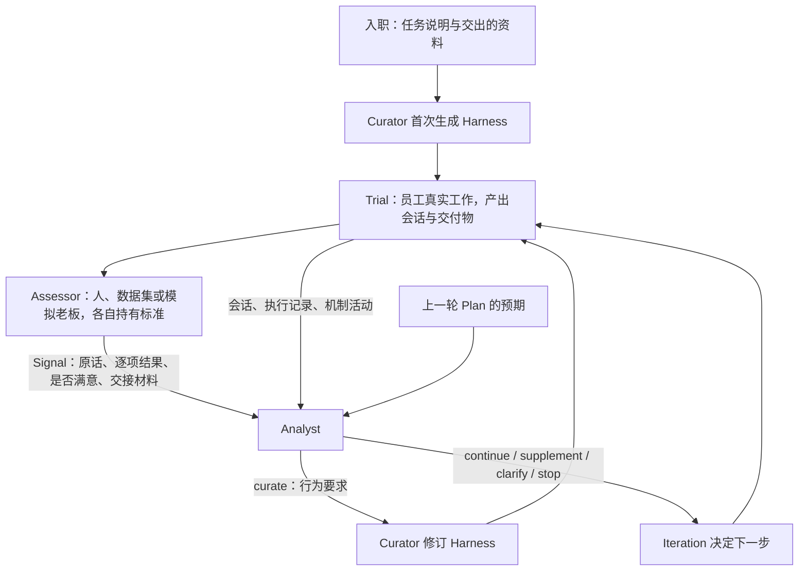
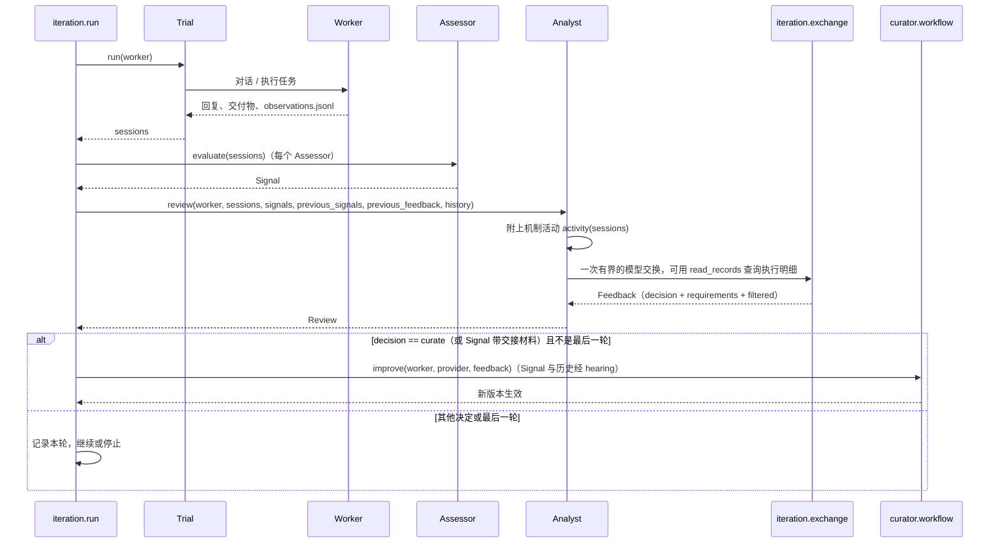

# 迭代自我改进：Iteration 与 Analyst

Curator 一次生成的 Harness 不会一开始就完全对。本文说明 Harness 怎样在多轮交互里被持续改进：每轮让员工真实工作，Assessor 按自己持有的标准说出问题，Analyst 把话整理成要求，Curator 据此修订，下一轮再检验。Curator 本身的结构见 [design.md](design.md)。

## 1. 闭环

- 入职那次 curation 没有任何执行记录，Curator 只凭任务和资料生成机制。
- 之后每轮先执行、再评价、再修订。最后一轮只评价、不修订，因为没有下一轮能检验那次修订。
- 停止条件：Analyst 决定 stop；本轮没有任何 Signal；所有 Assessor 都满意且不需要修订；或轮次用完。

## 2. 角色与信息边界

| 角色 | 看得到 | 看不到 | 产出 |
|---|---|---|---|
| Trial | 员工与对话方的往来 | 评价标准 | 本轮会话 |
| Assessor | 对话、交付物、自己持有的标准 | 员工内部实现 | `Signal`，附件即交出的材料 |
| Analyst | Assessor 的原话与逐项结果、会话、执行记录、机制活动、上一轮预期 | Assessor 的标准本身 | `Feedback`：决定与行为要求 |
| Curator | 行为要求、Assessor 的评语与交接材料、机制活动、跨轮历史（每轮是否满意、要求与修订）、当前 Harness、执行观测 | 评价标准、逐项判定、分数、参考答案 | 修订后的 Harness |

三条边界：

- **Assessor 的标准是它的私有状态。** 准则、材料、参考、留出样例由 Assessor 自己持有，闭环只看到 `Signal`；Assessor 决定 Analyst 看到多少（旅行社只给评语，数据集给逐例结果）。逐项判定、分数、参考答案止于 Analyst；Assessor 的评语、是否满意和交接材料由闭环原样转述给 Curator，Analyst 的要求随之送达。这条由 `iteration/hearing.py` 保证，不依赖 Assessor 自己删减。
- **Analyst 停在诊断层。** 它说明哪个行为没达到、证据是什么、和上一轮预期差在哪；不说改哪个策略面、怎样实现。机制归因是 Curator 的事，只有 Curator 能读源码和装配事实。
- **要求可观察、不写答案。** 每条要求写情境与期望行为、实际行为、证据、验收方式，不写"加一个 intake 清单"这类机制建议。

## 3. 一轮的调用时序

每轮的会话、Signal、Feedback、curation 记录都按轮关联写进 worker 根目录的 `iteration/`、`analysis/`、`curation/`，读者可以随运行进度查看。

## 4. Analyst

输入是一组固定的通用字段：任务、本轮与上一轮的 Signal、会话、上一轮预期、上一份 Feedback、历史、技能与组合结构、节点要求、证据位置。执行明细不整段塞进去，由模型用 `read_records` 按需查询。

处理在一次模型交换里完成：

1. **分离**：一段话里可能同时有任务补充、行为评价和控制意图，分开处理。
2. **过滤**：运行故障、证据找不到的评价、已兑现的要求，不触发修订，并在记录里写明原因。
3. **归纳**：多条评价指向同一行为时合并，一条评价涉及多个行为时拆开；对照上一轮预期标注是新要求、承诺未兑现，还是已兑现但仍不满意。
4. **表达**：按 `Requirement` 写出行为、实际表现、证据、验收、强度与复发次数。

输出 `Feedback` 的决定有五种：`curate`、`continue`、`supplement`（缺材料）、`clarify`（需要澄清）、`stop`。其中 `supplement` 与 `clarify` 目前没有出口：闭环里还没有 Analyst 向 Assessor 回话的机制，这两种决定连同理由写进本轮记录后，下一轮照常开跑，与 `continue` 相同。补上 Assessor 的回应是后续任务，见 `notes/2026-09-28-loop-roles-design.md` 第 9 节。

**机制活动。** Analyst 会把"装上的机制本轮实际做了什么"一并交给 Curator（`analyst/activity.py`）：哪条审核放行了几次、打回了几次、理由是什么，哪个工具调用失败了。Curator 据此核对自己上一轮的修订是否起效，而不是只看它的计划。

## 5. 一条反馈怎样变成执行层机制

以模拟场景的展示案例为例：老板在第 1 轮指出，方案 PPT 里写着"来源：调研第 2 节"这类内部备注，酒店名旁边没标"以计调确认为准"。

1. 这段话被整理成要求：客人拿到的方案里不能出现内部备注，出现酒店名就要标注；证据是第 1 轮方案第 4 页原文；验收是下一轮方案里没有这类字样。（这个案例用的是单层做法，老板的评审直接给出要求；现在默认由通用 Analyst 从老板原话整理。）
2. Curator 在 understand 阶段核对：当前只有 playbook 节点提示词在约束需求单内容，没有执行层检查。它在 select 阶段决定，在写需求单的子 Harness 上加一个 `action.strategy`：需求单写盘前检查内部字样和酒店标注，不合格就打回重写；同时给做 PPT 的子 Harness 加一个自检工具。
3. 第 2 轮，内部备注没有了，但出现新的问题：门票被概括成"一人免票、一人半价"。Curator 这次在同一个审核里加上"按每个孩子的年龄和调研原文逐个核对"的检查。
4. 第 3 轮，这项要求守住了；机制活动显示审核实际打回了 4 次需求单。

## 6. 场景的输入类别与可见边界

一个场景的输入落在一组封闭的类别里（`experimental/scenario/`）。类别从闭环的参与者推出：伙伴、它工作的世界、交互方、机制；场景输入只能描述前三者、交互怎样进行、以及之前发生过什么。加载器读场景目录时要求每个文件都属于一个类别，否则拒绝。

| 类别 | 内容 | 默认可见 |
|---|---|---|
| 情境 situation | 岗位说明；题例（角色卡与抽值，带标准答案的题例另有期望） | 岗位说明给所有角色；题例只给工作对象与交互方；期望只给交互方与 Analyst |
| 陈述 statements | 规范（交出的文档）与检查项（由规范派生的评审表） | 规范交出后给伙伴、Curator、交互方、Analyst；检查项只给交互方与 Analyst |
| 资料 materials | 每件带种类：norm、fact、exemplar、counterexample | 交出后给伙伴与 Curator；范例学形不学实 |
| 约定 exchange | 披露日程、交互方的可观察面、入职与交接话术 | 日程与可观察面只有交互方；话术是交互方说出的话，说给谁谁就听到，不封印 |
| 先验 prior | 往期培养记录 | 记录本身只给交互方与 Analyst；它的类型化历史按 Curator 受众投影后进入每次改造，打开会话时先按本运行的封印扫描 |
| 辅助 aids | 尺子的声明（`reference.md`）与记录标签（`record.md`） | 只有交互方 |

角色是伙伴 partner、工作对象 conversant（伙伴干活时面对的人）、交互方 party（持有资料与标准、对 Curator 说话的人）、Analyst、Curator。可见性按"谁产生"定：交互方主动说的可以到 Curator；评价机制推导的（检查项、逐项判定、期望答案、尺子）不到；伙伴内部的到 Curator 与 Analyst，不到工作对象；工作对象内部的只到交互方。`contract.json` 可按项收紧或放宽。声明由三处执行：装配（放进伙伴 home 的项）、听取（`hearing.py`，评价侧到 Curator 的唯一通道）、探索（`Withheld`）。

`iteration/session.py` 把 `run` 的一轮拆成可单步调用的 `Session`：`onboard`、`trial`、`signal`、`assess`、`analyse`、`curate`、`skip`、`finish`。每步之后记录写盘，与 `run` 的记录同布局，`Session.resume` 从记录继续。`analyse` 返回 `Outcome`，说明闭环自己会怎么走；调用方可以照做，也可以另作决定。自动运行与人工会话共用这套步骤。

## 7. 场景怎样接入

闭环本身不认识任何场景。一个场景只需提供：

| 通用接口 | 场景提供 |
|---|---|
| `Trial.run(worker) -> Sessions` | 谁和员工对话（真人、模拟客人、数据集样例） |
| `assessor.role.Assessor.evaluate(sessions) -> Signal` | 谁持有标准、怎样评价、怎样说话；交出的材料放在 `Signal.attachments`。通用实现在 `assessor/`（真人、数据集） |
| 任务说明与材料 | 员工的岗位说明，以及何时交出哪些资料 |

Analyst 是通用的，场景不必提供。真人入口是 `python -m experimental.iteration`：真人既是对话方也是 Assessor。旅行社模拟在 `experimental/simulation/`，见上一级 [README](../README.md)。
